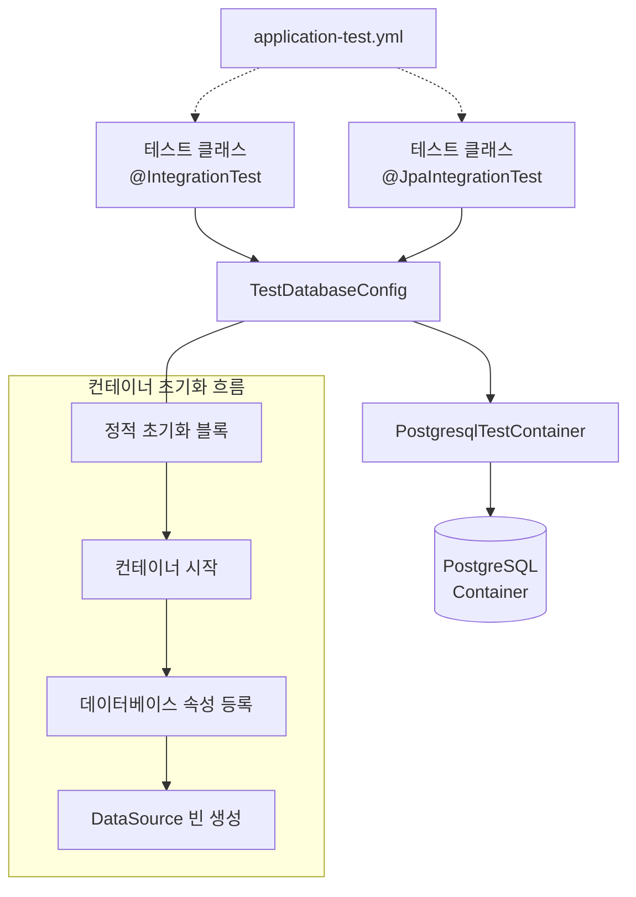
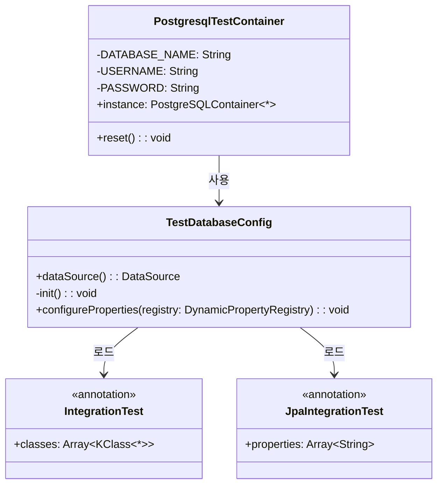
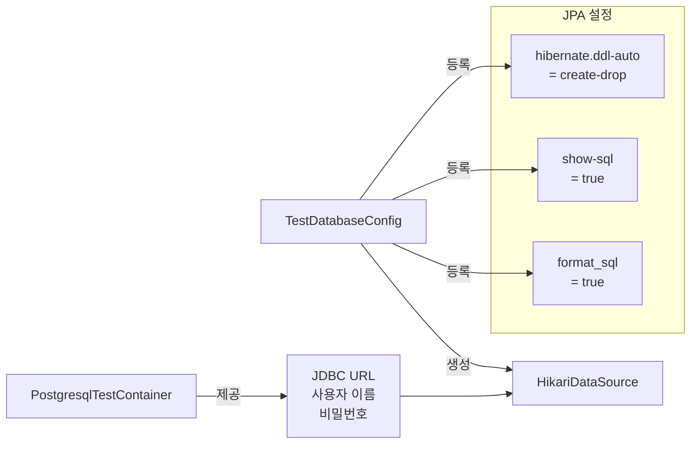
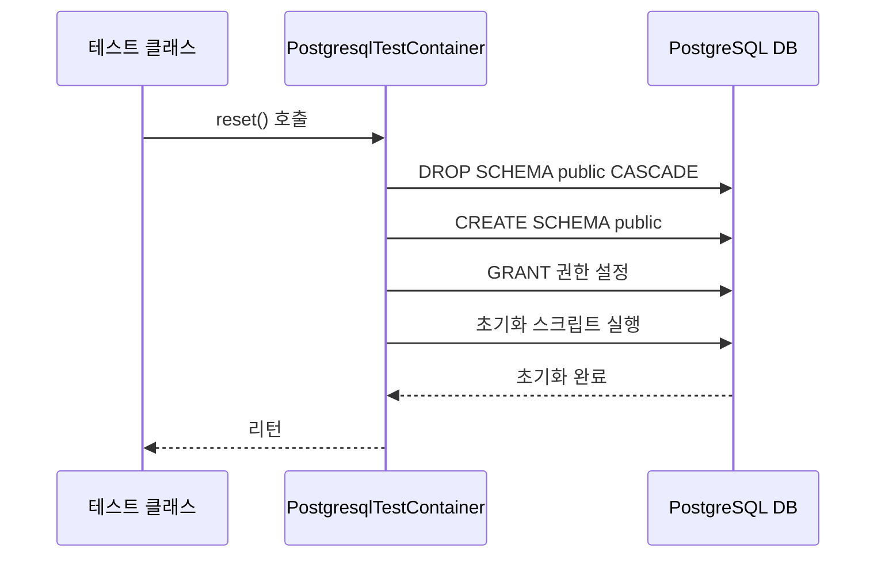
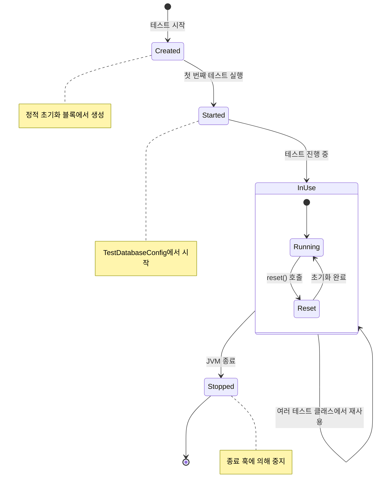

# Spring Boot 통합 테스트 가이드

## 1. IntegrationTest 사용법

### 1.1 기본 통합 테스트 (@IntegrationTest)

`@IntegrationTest` 어노테이션은 Spring Boot 애플리케이션의 전체 컨텍스트를 로드하여 통합 테스트를 수행할 수 있게 해줍니다.

```kotlin
@IntegrationTest
class UserServiceIntegrationTest {

    @Autowired
    private lateinit var userService: UserService
    
    @Test
    fun `사용자 생성 테스트`() {
        // given
        val userDto = UserCreateDto("test@example.com", "password", "Test User")
        
        // when
        val result = userService.createUser(userDto)
        
        // then
        assertNotNull(result.id)
        assertEquals("Test User", result.name)
    }
}
```

`@IntegrationTest`는 내부적으로 다음 어노테이션들을 포함합니다
- `@SpringBootTest`: Spring Boot 애플리케이션 컨텍스트 로드
- `@ActiveProfiles("test")`: 테스트 프로파일 활성화
- `@Testcontainers`: TestContainers 지원 활성화
- `@Transactional`: 각 테스트 메서드를 트랜잭션으로 실행하고 롤백

기본적으로 `TestDatabaseConfig`가 자동으로 로드되어 테스트 컨테이너 설정을 제공합니다.

### 1.2 JPA 특화 통합 테스트 (@JpaIntegrationTest)

리포지토리 레이어만 테스트하려면 `@JpaIntegrationTest` 어노테이션을 사용하세요

```kotlin
@JpaIntegrationTest
class UserRepositoryTest {

    @Autowired
    private lateinit var userRepository: UserRepository
    
    @Test
    fun `이메일로 사용자 조회 테스트`() {
        // given
        val user = User(email = "test@example.com", password = "encoded_password", name = "Test User")
        userRepository.save(user)
        
        // when
        val found = userRepository.findByEmail("test@example.com")
        
        // then
        assertTrue(found.isPresent)
        assertEquals("Test User", found.get().name)
    }
}
```

`@JpaIntegrationTest`는 내부적으로 다음 어노테이션들을 포함합니다
- `@DataJpaTest`: JPA 관련 컴포넌트만 로드
- `@ActiveProfiles("test")`: 테스트 프로파일 활성화
- `@Testcontainers`: TestContainers 지원 활성화
- `@Transactional`: 각 테스트 메서드를 트랜잭션으로 실행하고 롤백
- `@AutoConfigureTestDatabase(replace = NONE)`: 실제 데이터베이스 사용
- `@Import(TestDatabaseConfig::class)`: 테스트 데이터베이스 설정 로드

### 1.3 추가 설정 클래스 로드하기

특정 테스트에서 추가 설정 클래스를 로드해야 할 경우:

```kotlin
@IntegrationTest(classes = [TestDatabaseConfig::class, MockSecurityConfig::class])
class SecurityIntegrationTest {
    // 추가 보안 설정이 적용된 테스트
}
```

### 1.4 트랜잭션 관리

모든 테스트는 `@Transactional` 어노테이션으로 인해 자동으로 롤백됩니다. 추가적으로 `TestTransactionEventListener`는 테스트 클래스 종료 시 롤백을 보장합니다.

트랜잭션 롤백을 비활성화해야 하는 경우:

```kotlin
@IntegrationTest
@Rollback(false) // 트랜잭션은 유지하되 롤백하지 않음
class NonRollbackTest {
    // 변경사항이 데이터베이스에 커밋됨
}

// 또는

@IntegrationTest
@Transactional(propagation = Propagation.NEVER) // 트랜잭션 자체를 비활성화
class NonTransactionalTest {
    // 트랜잭션 없이 실행
}
```

### 1.5 데이터베이스 초기화

특정 테스트에서 데이터베이스를 완전히 초기화해야 하는 경우:

```kotlin
@IntegrationTest
class ResetDatabaseTest {

    @BeforeEach
    fun setUp() {
        PostgresqlTestContainer.reset() // 데이터베이스 스키마 초기화 및 재생성
    }
    
    @Test
    fun `초기 상태에서 테이블이 비어있는지 확인`() {
        // 테스트 코드
    }
}
```

## 2. TestContainer 현재 설정 구성

### 2.1 아키텍처 다이어그램



### 2.2 PostgresqlTestContainer 구성



### 2.3 컨테이너 주요 설정

PostgreSQL 컨테이너는 다음과 같이 구성됩니다:

```kotlin
PostgreSQLContainer(DockerImageName.parse("postgres:16-alpine")).apply {
    withDatabaseName("testdb")
    withUsername("test")
    withPassword("test")
    withReuse(System.getProperty("testcontainers.reuse.enable")?.toBoolean() ?: false)
    withInitScript("sql/init.sql")
}
```

주요 특징:
- **이미지**: PostgreSQL 16 Alpine (경량화 버전)
- **데이터베이스 이름**: testdb
- **사용자 인증**: username=test, password=test
- **컨테이너 재사용**: `-Dtestcontainers.reuse.enable=true` JVM 옵션으로 활성화 가능
- **초기화 스크립트**: `sql/init.sql` 파일을 사용하여 데이터베이스 스키마 초기화

### 2.4 데이터베이스 연결 설정



### 2.5 데이터베이스 초기화 흐름



### 2.6 컨테이너 수명 주기



위 설정을 통해 개발자는 실제 데이터베이스와 유사한 환경에서 통합 테스트를 안정적으로 수행할 수 있습니다.
